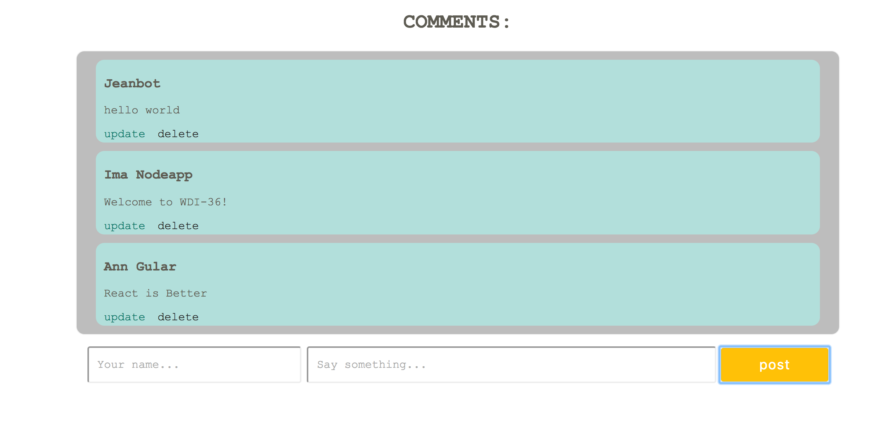

# MERN comment box app

## Objectives

* Utilize React skills to build a comment box frontend
* Apply Mongo and Express knowledge to build a fully functional MERN app

## Intro

So far, we've delved into basic React app frontend architecture. Now, let's take a stab at a full MERN stack CRUD app!

### What you should already know:

* Basic ES6
* Basic React component syntax and structure
* When to use React `state` and `props`
* MongoDB structure and mongoose methods / syntax
* Express routing
* Node/NPM setup

This guide will walk you through a scaffolded MERN stack app - you'll be focusing mainly on the React part of MERN. Definitely take some time during the lab to check out what's going on in `server.js` and re-familiarize yourself with express routing.

## Setup

Clone this repo down and take a look at the file structure.

*Note: If you were to create this React app from scratch, you would be using the command create-react-app mern-comment-box.*

By the end of this lesson, your file structure should end up looking like so:

```
- model
  - comments.js
- node_modules
  - ...various modules...
- src
  - Comment.js
  - CommentBox.js
  - CommentForm.js
  - CommentList.js
  - index.js
  - style.js
- .gitignore
- data.js
- index.html
- package.json
- README.md
- server.js
```

You'll need to create the missing files in the `src` directory to build out our front-end React components.

Make sure to run `npm install --save` to install dependencies!

Take a look at `package.json`. What is familiar? What's new?

* Mongoose, express, body-parser, and nodemon should be familiar.
* jQuery is a library that will let us use HTTP methods to communicate with our database.
* Foreman allows us to boot up our API and webpack-dev-server simultaneously.

You will also notice that we're using a .js file for our styles, which has been provided for you. This is known as *modular inline css styling* and is alternative way to add style. You could also have done this with a .css file.




## Workflow - getting updates

* In GitHub, copy the clone url of the class version of this repository.  Back in your Terminal, navigate to your local repository for this project. Run the following command (paste in the class repo clone url instead of typing `CLASS_REPO_CLONE_URL`):

    ```sh
    git remote add upstream CLASS_REPO_CLONE_URL
    ```

* In the future, if the class version of a branch gets updated, you can pull these updates directly from the `upstream` remote.  Try this now with the master branch:

    ```sh
    git checkout master
    git pull upstream master
    ```


## Sprints

#### Sprint 1

[Sprint 1: Component Setup](docs/Sprint1.md)

#### Sprint 2

 [Sprint 2: Database Configuration](docs/Sprint2.md)

#### Sprint 3

 [Sprint 3: Procfile and Serving](docs/Sprint3.md)

#### Sprint 4

 [Sprint 4: GET and POST](docs/Sprint4.md)

#### Sprint 5

 [Sprint 5: AJAX](docs/Sprint5.md)

#### Sprint 6

 [Sprint 6: the UD](docs/Sprint6.md)

 #### Sprint 7

  [Sprint 7: ...with a real backend](docs/Sprint7.md)
